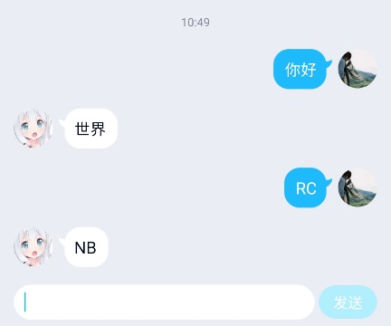

RUST_PROC_QQ
============

基于 [RS-QQ](https://github.com/lz1998/rs-qq) + 过程宏 的QQ机器人框架/模版

## 框架目的

- 简单化 : 让程序员写更少的代码
    - 自动管理客户端生命周期以及TCP重连
    - 封装登录流程, 自动获取ticket, 验证滑动条
- 模块化 : 让调理更清晰, 实现插件之间的分离

## 如何使用 / demo

### 引用

Cargo.toml

```toml
proc_qq = { git = "https://github.com/niuhuan/rust_proc_qq.git", branch = "master" }
```

### 声明一个模块

hello_module.rs

```rust
use proc_qq::{event, Module};
use proc_qq::re_export::rs_qq::client::event::{GroupMessageEvent, PrivateMessageEvent};
use proc_qq::re_export::rs_qq::msg::elem::Text;
use proc_qq::re_export::rs_qq::msg::MessageChain;

/// 监听群消息
/// 使用event宏进行声明监听消息
/// 参数为rs-qq支持的任何一个类型的消息事件, 必须是引用
/// 返回值为 anyhow::Result<bool>, Ok(true)为拦截事件, 不再向下一个监听器传递
#[event]
async fn group_hello(event: &GroupMessageEvent) -> anyhow::Result<bool> {
    let content = event.message.elements.to_string();
    if content.eq("你好") {
        let chain = MessageChain::new(Text::new("世界".to_string()));
        event
            .client
            .send_group_message(event.message.group_code, chain)
            .await?;
        Ok(true)
    } else if content.eq("RC") {
        let chain = MessageChain::new(Text::new("NB".to_string()));
        event
            .client
            .send_group_message(event.message.group_code, chain)
            .await?;
        Ok(true)
    } else {
        Ok(false)
    }
}

/// 监听
#[event]
async fn private_hello(event: &PrivateMessageEvent) -> anyhow::Result<bool> {
    let content = event.message.elements.to_string();
    if content.eq("你好") {
        let chain = MessageChain::new(Text::new("世界".to_string()));
        event
            .client
            .send_private_message(event.message.from_uin, chain)
            .await?;
        Ok(true)
    } else if content.eq("RC") {
        let chain = MessageChain::new(Text::new("NB".to_string()));
        event
            .client
            .send_private_message(event.message.from_uin, chain)
            .await?;
        Ok(true)
    } else {
        Ok(false)
    }
}

/// 返回一个模块 (向过程宏改进中)
pub(crate) fn module() -> Module {
    Module {
        id: "hello".to_owned(),
        handles: vec![group_hello {}.into(), private_hello {}.into()],
    }
}
```

### 启动

main.rs

```rust
use tracing::Level;
use tracing_subscriber::{layer::SubscriberExt, util::SubscriberInitExt};

use proc_qq::Authentication::{QRCode, UinPassword};
use proc_qq::ClientBuilder;

mod hello_module;

/// 启动并使用为二维码登录
#[tokio::test]
async fn test_qr_login() {
    // 初始化日志打印
    init_tracing_subscriber();
    // 使用builder创建
    ClientBuilder::new()
        .priority_session("session.token")      // 默认使用session.token登录
            // .device(JsonFile("device.json")) // 设备默认值 
        .authentication(QRCode)                 // 若不成功则使用二维码登录
        .build(vec![hello_module::module()])    // 您可以注册多个模块
        .await
        .unwrap()
        .start()
        .await
        .unwrap()
        .unwrap();
}

/// 启动并使用为密码登录
#[tokio::test]
async fn test_password_login() {
    init_tracing_subscriber();
    ClientBuilder::new()
        .priority_session("session.token")
        .authentication(UinPassword(123456, "password".to_owned()))
        .build(vec![])
        .await
        .unwrap()
        .start()
        .await
        .unwrap()
        .unwrap();
}

fn init_tracing_subscriber() {
    tracing_subscriber::registry()
        .with(
            tracing_subscriber::fmt::layer()
                .with_target(true)
                .without_time(),
        )
        .with(
            tracing_subscriber::filter::Targets::new()
                .with_target("rs_qq", Level::DEBUG)
                .with_target("proc_qq", Level::DEBUG)
                .with_target("proc_qq_examples", Level::DEBUG),
        )
        .init();
}

```

### 效果


